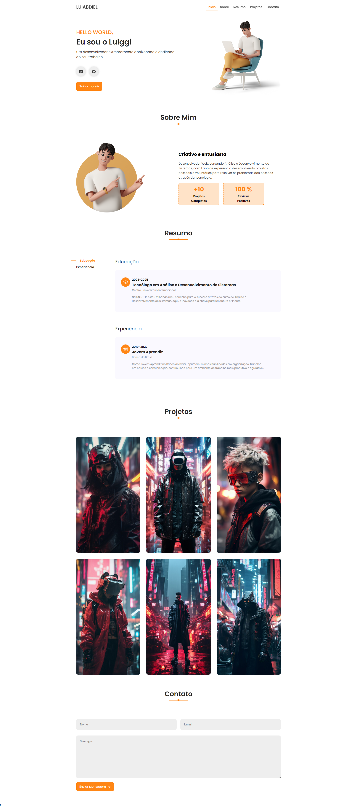

# **Projeto Portfolio**

Este repositório contém o projeto Portfolio desenvolvido como parte do curso de Análise e Desenvolvimento de Sistemas na disciplina de Fundamentos da Programação Web. O projeto é uma representação digital do seu portfólio pessoal e foi criado usando apenas HTML, CSS e JavaScript.



O deploy do projeto foi realizado na plataforma Vercel para torná-lo acessível online.

### **Descrição do Projeto**

O Projeto Portfolio é uma aplicação web que visa mostrar suas habilidades, projetos e experiência de forma organizada e atraente. Este projeto é uma maneira eficaz de apresentar seu trabalho e conquistas aos empregadores, recrutadores e outros interessados.

### **Recursos e Funcionalidades**

O projeto Portfolio inclui as seguintes funcionalidades e recursos:

- Página Inicial: Uma página inicial que fornece uma visão geral do seu portfólio e uma introdução sobre você.

- Seção de Experiência: Informações sobre sua experiência profissional, incluindo empresas em que trabalhou, cargos desempenhados e datas relevantes.

- Seção de Projetos: Uma área dedicada para listar e descrever projetos nos quais você trabalhou. Cada projeto inclui uma imagem, descrição e links relevantes.

- Formulário de Contato: Um formulário de contato que permite que visitantes entrem em contato com você diretamente.

### **Como Executar o Projeto Localmente**

Se você deseja executar o projeto em sua máquina local para fins de desenvolvimento ou teste, siga estas etapas:

1. Clone o Repositório: Use o comando Git para clonar este repositório em seu ambiente de desenvolvimento local.

```
git clone https://github.com/seu-usuario/nome-do-repositorio.git
```

2. Abra o Projeto: Navegue até o diretório do projeto e abra o arquivo index.html em um navegador da web para visualizar o projeto localmente.

3. Personalize o Conteúdo: Edite o conteúdo dos arquivos HTML, CSS e JavaScript para refletir suas informações pessoais e projetos.

4. Teste e Valide: Certifique-se de testar todas as funcionalidades e validar o layout em diferentes dispositivos e navegadores.

### **Deploy Online**

Este projeto Portfolio está implantado na plataforma Vercel e pode ser acessado online através do seguinte link: https://luiggiabdiel.vercel.app/
